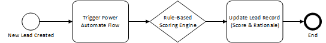
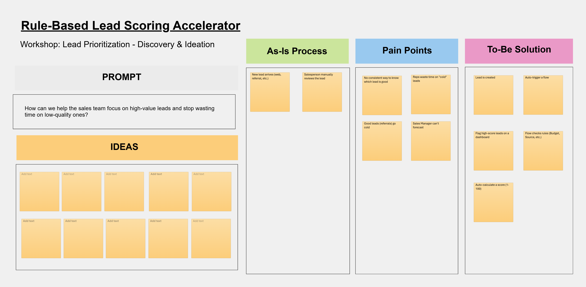
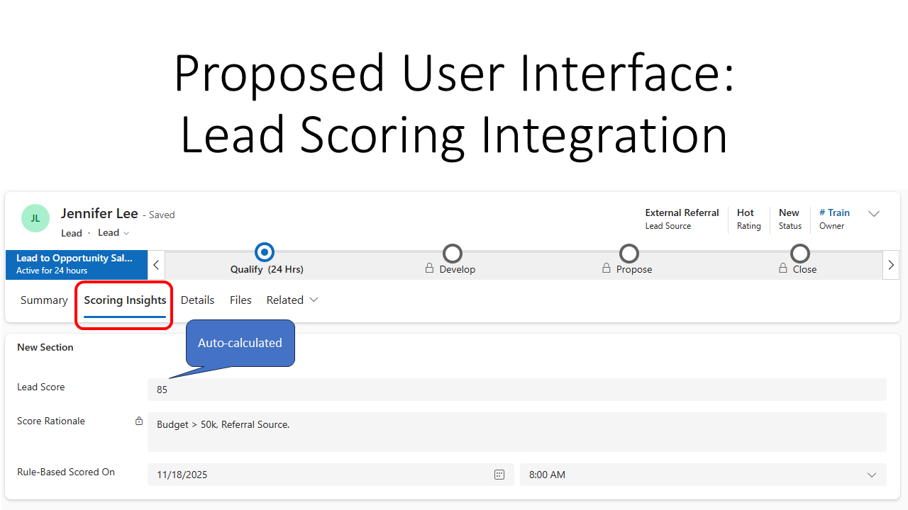
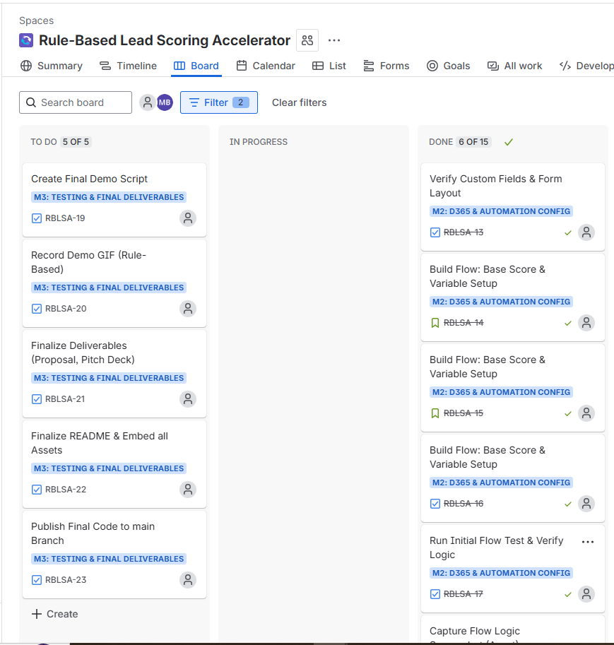
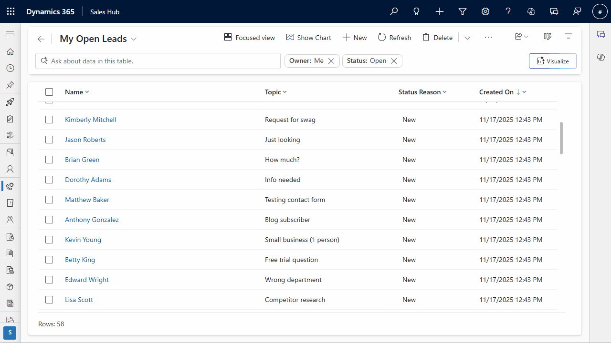

# 🚀 Rule-Based Lead Scoring Accelerator

> **Optimized for:** Dynamics 365 CE Functional and Pre-sales Consultant Roles
> **Status:** ✅ Complete (v1.0.0 Release Ready)

---

## 📋 Project Overview

This portfolio project demonstrates a **Rule-Based Lead Scoring Accelerator**—a high-value Proof of Concept (PoC) built directly into Dynamics 365 Sales.

It replaces subjective lead prioritization with a transparent **Automated Scoring Engine** implemented via Power Automate. This approach showcases the ability to design solutions that are **cost-effective** (no expensive AI licenses needed) and **auditable** (clear logic for every score).

## 🎯 Business Objectives & Value

The solution aims to:

- **Standardize Prioritization:** Eliminate subjective guessing by applying consistent business rules.
- **Improve Efficiency:** Automate the calculation so sales reps focus on selling.
- **Enhance Visibility:** Provide immediate visual indicators for high-quality leads.

---

## 🛠️ Tech Stack & Skills Demonstrated

- **D365 Sales:** Core customization of the `Lead` entity, forms, and views.
- **Power Automate:** Logic engine (Flow) implementation, including variable initialization, conditional logic, and record updating.
- **Consulting & Design:** Functional Design Document (FDD), Fit/Gap Analysis, and Workload Estimation.
- **Project Management:** Agile tracking using JIRA.
- **Dataverse:** Solution management and low-code platform expertise.

---

## 1. Solution Architecture & Flow

The solution runs entirely within the Power Platform. It triggers instantly on lead creation to apply a simple rule matrix.

### To-Be Process Flow

_(This diagram shows the logic you created in Visio)_

### Rule-Based Logic

The core flow uses a simple rule matrix: **Base Score (50)** + **30 Points** (High Budget) + **20 Points** (Referral Source) + **10 Points** (Financial Industry).

---

## 2. Consulting & Design Deliverables

These documents demonstrate the professional process followed for client engagement.

### 2.1 Initial Discovery Workshop

_(Proof you understand the business problem before building)_

### 2.2 Form Prototyping & Customization

_(Proof you design the User Experience before implementing it)_

### 2.3 Project Management & Tracking

_(Proof you manage projects and use Agile tools)_

---

## 3. Technical Proof & Live Demonstration

The final test proves the end-to-end automation engine is working:

### End-to-End Demo GIF

_(This is the most crucial asset: showing the system in action)_

### Supporting Documentation

- [**Functional Design Document (FDD)**: The technical blueprint and scoring logic matrix](deliverables/Functional_Design_Document.md)
- [**Solution Proposal**: Client-facing business proposal and value statement](deliverables/Solution_Proposal.md)
- [**Workload Estimate**: Consultant's ROM for PoC and Production phases](deliverables/Workload_Estimate.md)
- [**Pitch Deck Outline**: Slide structure for a client webinar](deliverables/Pitch_Deck_Outline.md)

---

_Built by Mirza Zohaib Baig as a portfolio demonstration of Functional Consultant & Pre-Sales skills._
